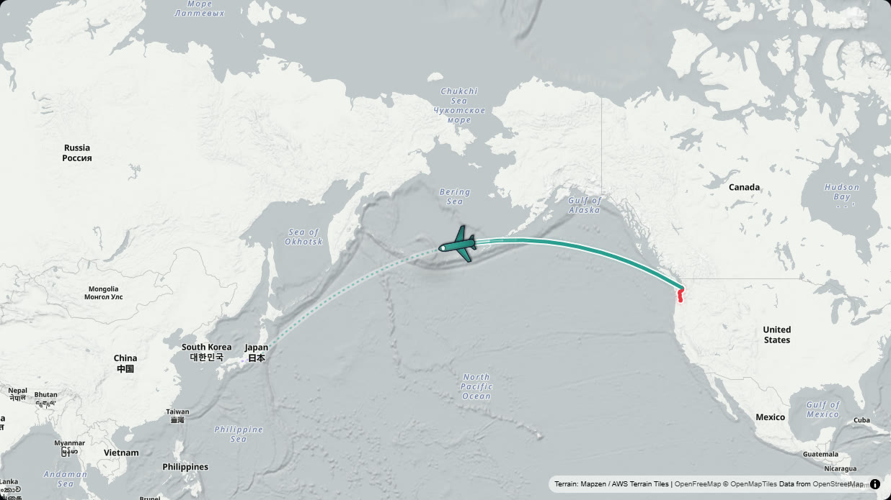

# Visual Trip Maker

**Turn a route into a smooth, animated map video, entirely in your browser.**

Draw your trip on a map, switch between cars, planes, trains and boats along the way, drop markers with photo cards, set up a camera, and export an MP4 up to 4K, with sound if you like. No account, no uploads, no watermark.

By **Geekatplay Studio** · Vladimir Chopine


## Features

- **Draw routes your way.** Click to place points, drag to adjust, or import a GPX or KML track. Each leg can follow real roads, a smooth curve, straight lines or a flight arc.
- **Change transport along the trip.** One continuous route made of legs: drive to the airport, fly, take a taxi, board a train. Pick the next transport while drawing, or split a leg from any point. The video pauses at each change while the camera glides to the new framing.
- **Shortest flight paths.** Great-circle arcs that take the short way round the globe, including across the date line.
- **15 transports.** Car, 4x4, camper, bus, motorcycle, bicycle, on foot, two trains, two planes, helicopter, balloon, boat and ferry, each with shaded symbols, shadows and motion trails (contrails, wakes, smoke, dust).
- **Markers and story cards.** Pins, flags, dots, polaroid photos and text, 25 icons, any colour. Pop in on arrival, pause the animation, show a card with title, subtitle and photo.
- **Camera director.** Follow the line with automatic per-leg framing (walking close, driving a little out, flying wide), zoom per transport, look-ahead, steadiness, tilt, north-up or direction of travel), glide between two saved shots, or hold a fixed view. Intro zoom-in and outro pull-back included.
- **Maps that look good.** Crisp vector basemaps (light, dark, streets, bright, fiord, treasure map), satellite and topographic, with optional 3D terrain and hillshade. No API keys needed.
- **Sound.** A synthesised engine or wind bed per transport, a whoosh at every transport change and a chime at every stop, optionally mixed into the exported video.
- **Frame-exact export.** H.264 MP4 at 720p to 4K, in landscape, vertical or square, at 24, 30 or 60 fps. Every frame is rendered and encoded on your machine, so the result never depends on how fast your computer is.
- **Built-in help.** A guide and keyboard shortcuts one click away.

## Screenshots

| | |
| --- | --- |
|  |  |
| **Change transport along the route.** Car, plane, taxi, train: pick the next transport and keep drawing. | **3D terrain** with a tilted camera and a 3D vehicle. |
|  |  |
| **Camera director.** Zoom per transport, look-ahead, steadiness, tilt. | **Markers and story cards.** Photos, icons, pauses. |
|  |  |
| **Map styles, terrain and symbols.** | **Vertical 9:16** for Reels, Shorts and TikTok. |
|  |  |
| **Export** up to 4K, with optional sound. | **Shortest flight path** across the Pacific. |

## Quick start

Requirements: **Node.js 20 or newer** and a current **Chrome or Edge** (needed for MP4 export).

Windows (PowerShell):

```powershell
.\scripts\install.ps1   # install dependencies
.\scripts\build.ps1     # lint, type-check and build
.\scripts\start.ps1     # serve the app in the background
.\scripts\stop.ps1      # stop it
```

macOS, Linux or Git Bash:

```bash
./scripts/install.sh
./scripts/build.sh
./scripts/start.sh      # add --dev for hot reload, --port 8080 to change the port
./scripts/stop.sh
```

Then open **http://127.0.0.1:5173/**. Without the scripts:

```bash
npm install
npm run dev        # development server
npm run build      # production build in dist/
npm run preview    # serve dist/
```

| Script | What it does |
| --- | --- |
| `install` | Checks Node.js, installs the exact locked dependencies |
| `build` | Runs lint and type-check, then builds the production bundle into `dist/` |
| `start` | Starts the app in the background (production build by default, `-Dev` / `--dev` for the dev server) and writes the process ID to `.run/` |
| `stop` | Stops the background server |

## User manual

The full guide, with screenshots and a worked example, is in **[docs/USER_MANUAL.md](docs/USER_MANUAL.md)**.

## How it works

The route is split into legs. Each leg has a transport, a path shape, a speed and a style. The timeline is computed from the legs: travel time is shared out by distance and speed, marker pauses and transport-change pauses are added, and optional intro and outro moves are put around it. The camera, the symbol and the story cards are all pure functions of the time on that timeline. That is why the preview and the exported video match exactly, and why the camera moves are perfectly smooth at any frame rate.

```
src/
  App.tsx                    app state, playback, undo, autosave, road routing, export
  components/
    MapCanvas.tsx            map, route layers, markers, symbols, in-map editing
    Sidebar.tsx              Route / Markers / Camera / Style panels
    DrawToolbar.tsx          transport picker and point menu while drawing
    Timeline.tsx             scrubber with legs, pauses and markers
    Header.tsx, ExportModal.tsx, HelpModal.tsx
  services/
    geoUtils.ts              route model, timeline, great-circle arcs, GPX / KML, road routing
    cameraDirector.ts        camera pose for any time on the timeline
    mapStyles.ts             basemap styles and terrain source
    markerIcons.ts           canvas-drawn markers and vehicle symbols
    overlayPainter.ts        story cards and HUD, drawn into the video
    soundtrack.ts            offline soundtrack synthesis
    videoExporter.ts         WebCodecs H.264 / AAC encoder and MP4 muxer
    threeVehicles.ts         procedural 3D vehicle models
    presets.ts               templates and defaults
docs/                        user manual and screenshots
scripts/                     install, build, start and stop scripts
```

Built with React, TypeScript, Vite, Tailwind CSS, MapLibre GL JS, Three.js, Turf.js and mp4-muxer.

## Privacy

Everything runs in your browser. Your routes, photos and videos are never uploaded. Projects are stored in your browser's local storage, and you can save them as files. The app does contact public services to load map tiles, terrain, fonts, road routing and place search (listed below), and it loads any photo URLs you enter.

## Browser support

Current Chrome and Edge give you everything, including MP4 export with sound. Browsers without full WebCodecs support (older Firefox and Safari versions) can edit and preview, and export a WebM video without sound.

## Credits and data

Map data © [OpenStreetMap](https://www.openstreetmap.org/copyright) contributors, [OpenMapTiles](https://openmaptiles.org/), served by [OpenFreeMap](https://openfreemap.org/). Satellite imagery © Esri, Maxar, Earthstar Geographics. Topographic tiles © [OpenTopoMap](https://opentopomap.org/) (CC-BY-SA). Elevation from Mapzen / [AWS Terrain Tiles](https://registry.opendata.aws/terrain-tiles/). Road routing by the public [OSRM](https://project-osrm.org/) demo server and place search by [Nominatim](https://nominatim.org/). Template photos from [Unsplash](https://unsplash.com/). These services have usage policies, so please be considerate with heavy use.

## License

Copyright © 2026 Geekatplay Studio · Vladimir Chopine. All rights reserved. See [LICENSE](LICENSE).
