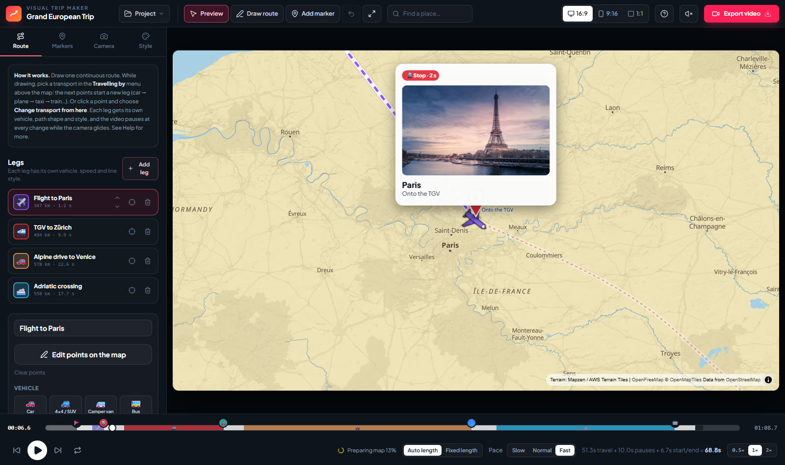
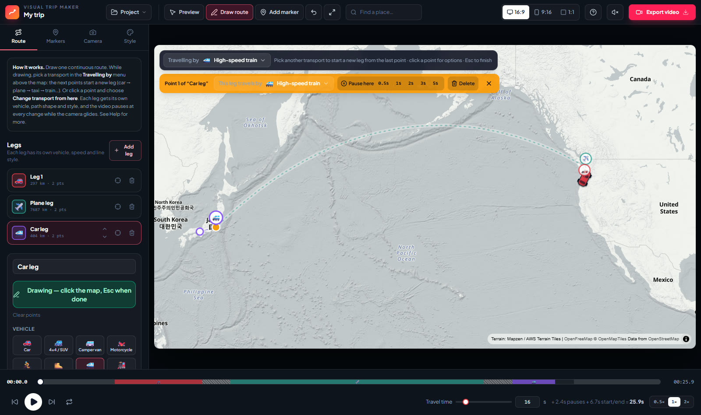
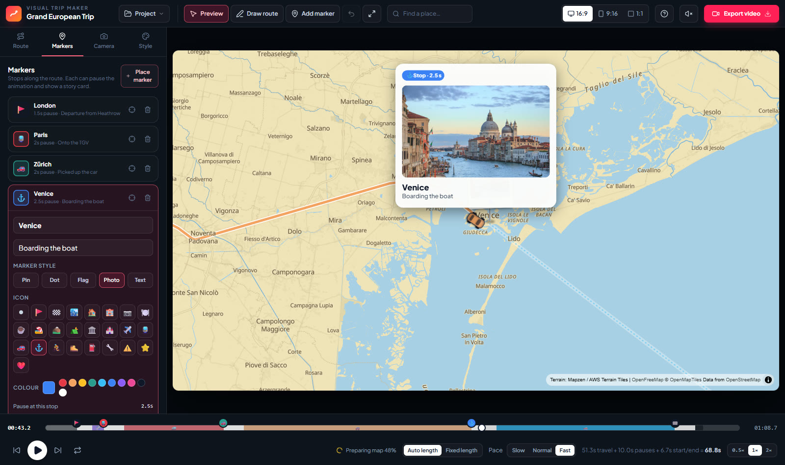
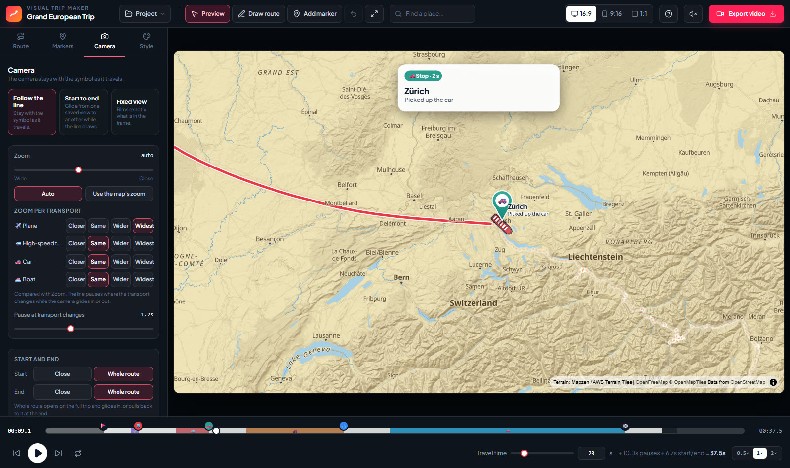
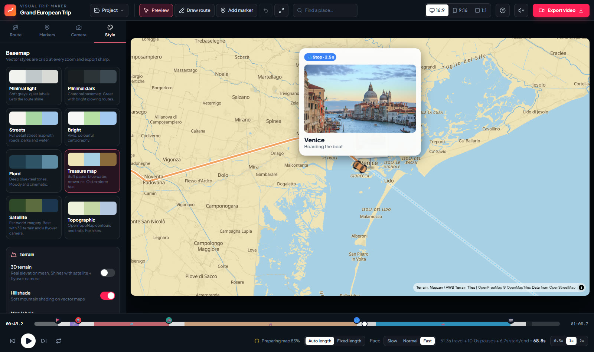
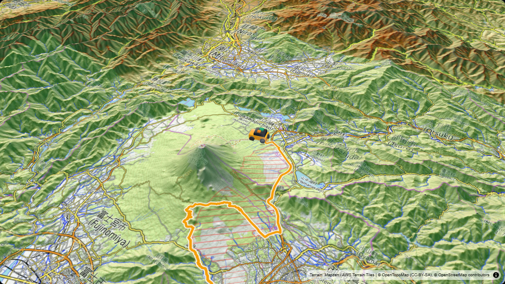
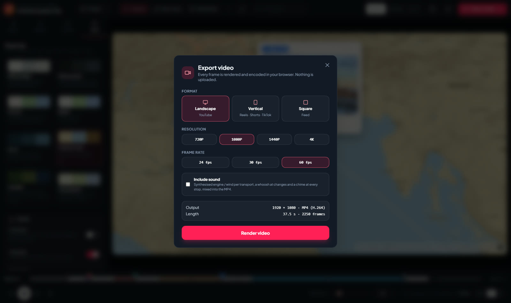
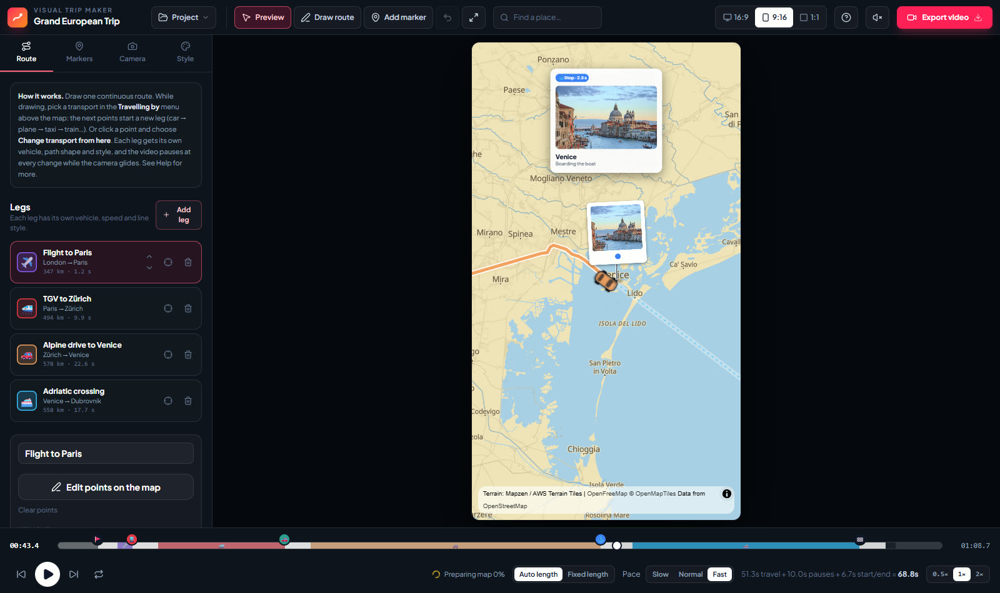

# Visual Trip Maker – User Manual

Visual Trip Maker by Geekatplay Studio turns a route on a map into an animated video. This manual walks through the whole workflow, from the first click to the finished MP4.

**Contents**

1. [Getting started](#1-getting-started)
2. [The screen](#2-the-screen)
3. [Draw a route](#3-draw-a-route)
4. [Change transport along the way](#4-change-transport-along-the-way)
5. [Markers, pauses and story cards](#5-markers-pauses-and-story-cards)
6. [Camera](#6-camera)
7. [Style: maps, terrain and symbols](#7-style-maps-terrain-and-symbols)
8. [Timeline and preview](#8-timeline-and-preview)
9. [Sound](#9-sound)
10. [Export your video](#10-export-your-video)
11. [Projects, templates and importing](#11-projects-templates-and-importing)
12. [Keyboard shortcuts](#12-keyboard-shortcuts)
13. [Tips](#13-tips)
14. [Troubleshooting](#14-troubleshooting)

---

## 1. Getting started

**Requirements:** Node.js 20 or newer, and Chrome or Edge for MP4 export.

Windows (PowerShell):

```powershell
.\scripts\install.ps1
.\scripts\build.ps1
.\scripts\start.ps1
```

macOS, Linux or Git Bash:

```bash
./scripts/install.sh
./scripts/build.sh
./scripts/start.sh
```

Open **http://127.0.0.1:5173/**. To use another port, run `start.ps1 -Port 8080` or `start.sh --port 8080`. To stop the app, run `stop.ps1` or `stop.sh`. For development with hot reload, add `-Dev` or `--dev` to the start script.

The app opens with a sample trip so you can press play straight away.

## 2. The screen



| Area | What it does |
| --- | --- |
| **Top bar** | Project menu (templates, new trip, import, open, save, reverse route), project name, tools (**Preview**, **Draw route**, **Add marker**, undo, frame the whole route), place search, aspect ratio, help, sound switch and **Export video**. |
| **Left panel** | Four tabs: **Route** (legs and vehicles), **Markers**, **Camera** and **Style**. |
| **Map stage** | Your video frame. It always has the aspect ratio you picked, so what you see is what you export. |
| **Timeline** | Scrubber with one coloured block per leg, white blocks for pauses, round buttons for markers, play controls, map-preparation status, Auto / Fixed length with pace or travel time, and preview speed. |

## 3. Draw a route

1. Click **Project → New empty trip**, or press **Draw route** (or `D`).
2. Use **Find a place** in the top bar to fly the map to your starting area.
3. Click on the map to place points. The line follows the shape of the current leg: roads for cars, a flight arc for planes, a smooth curve for boats, trains and walks.
4. Press `Esc` when you are done.

While drawing:

- **Drag** a point to move it.
- **Right-click** a point to delete it, or select it and press `Delete`.
- **Click** a point to open its menu (see the next section).
- `Ctrl+Z` undoes the last change.

### Path shape

Each leg has a **Path shape** in the Route tab:

| Shape | Use it for |
| --- | --- |
| **Roads** | Cars and bikes. The line snaps to real roads using a public routing service. Needs an internet connection; if it is unreachable you get a smooth curve and a message. |
| **Smooth** | Boats, trains, walks and anything else. A smooth curve through your points. |
| **Straight** | Straight lines between points. |
| **Flight arc** | Planes. The shortest great-circle path between your points, also across the date line. |

The shape is chosen automatically when you pick a transport, and you can change it at any time.

## 4. Change transport along the way

A trip is **one continuous line made of legs**. Each leg has its own transport, path shape, speed, colour and line style. There are two ways to change transport.

### While drawing: the *Travelling by* menu



Say you drive to the airport, fly, take a taxi and then a train:

1. Start with **Car** and click the points of the drive.
2. At the airport open **Travelling by** (above the map) and choose **Plane**. Your next click starts a new leg from the airport, drawn as a flight arc.
3. At the destination choose **Car** for the taxi, click a few points, then choose **High-speed train** and keep clicking.

Every leg start gets a round badge on the map with its vehicle. The timeline shows one block per leg with the vehicle on it, and the Route tab lists them all.

### From any point: *Change transport from here*

Click a point on the line. An orange bar appears with:

- **Change transport from here**: splits the leg at that point. Everything from there on travels by the transport you choose.
- **Pause here**: 0.5, 1, 2, 3 or 5 seconds. The line stops for a moment with nothing shown in the video.
- **Delete** the point.

### What happens in the video

At every transport change the line **pauses for a moment while the camera glides** to the framing of the next transport (planes can be framed wider than cars, walkers closer), and the symbol swaps halfway through. The length of this pause is set under **Camera → Pause at transport changes**. If you also put a marker with a pause on the same spot, that pause is used instead.

### Edit a leg

Select a leg in the Route tab to change its **Vehicle**, **Path shape**, **Speed** (higher than the transport's normal speed makes the leg quicker, lower makes it slower; the leg list shows the seconds each leg takes), **Line colour**, **Width**, **Solid, dashed or dotted** style and **Glow**. Use the arrows to reorder legs, the target icon to jump to a leg in the timeline, and the bin to delete it.

## 5. Markers, pauses and story cards



Press **Add marker** (or `M`) and click on the route. Select a marker in the Markers tab to edit it.

| Setting | Description |
| --- | --- |
| **Title / subtitle** | Shown next to the marker and on the story card. |
| **Marker style** | Pin, dot, flag, photo (polaroid) or text only. |
| **Icon and colour** | 25 icons and any colour. |
| **Pause at this stop** | 0 to 10 seconds. The line waits while the card is shown. |
| **Pop in on arrival / Always visible** | Reveal the marker when the line reaches it, or show it from the start. |
| **Show story card** | A card with the title, subtitle and photo appears at the stop. |
| **Photo URL** | Address of an image. For a polaroid marker the photo is shown on the marker, and on the card. |

Drag a marker to move it. Markers placed away from the line trigger at the nearest point of the line. **Marker size** and **Labels next to markers** are at the bottom of the Markers tab.

## 6. Camera



The camera has three modes.

### Follow the line

The camera stays with the symbol. Settings:

- **Zoom**: *Auto* frames every leg on its own, from the transport, its speed and the length of the leg: walking is filmed very close, cars and buses a little further out, trains and boats wider and flights wide. Very long legs, and hurried legs in a *Fixed length* video, are framed a bit wider so the map does not rush past. Or set a fixed zoom yourself, or click **Use the map's zoom** to copy what you see.
- **Zoom per transport**: *Closer, Same, Wider, Widest* fine-tunes the framing of each transport.
- **Pause at transport changes**: how long the line waits while the camera glides between framings.
- **Start and end**: *Whole route* opens on the full trip and zooms in, or pulls back to the full trip at the end. *Close* starts and ends on the symbol.
- **Which way is up**: *North up* (the map stays still), *Direction of travel* (the map rotates so you always travel up) or *Fixed angle*.
- **Look ahead**: moves the camera ahead of the symbol so you see more of where it is going.
- **Camera steadiness**: *Tight*, *Smooth* or *Very smooth*. Smoother cameras glide through bends instead of following every turn.
- **Tilt**: 0° is straight down, higher values give a flyover look. Combine with 3D terrain.

### Start to end

The camera glides from one saved view to another while the line is drawn.

1. Click a **quick move**: *Zoom out to reveal*, *Zoom in to finish* or *Pan along*. This sets both shots for you.
2. Fine-tune: move and zoom the map (it is free to move while this tab is open), then press **Use this view** for the start shot or the end shot. **Show** jumps back to a saved shot.
3. Choose *Smooth start and stop* or *Steady* movement.

### Fixed view

Films exactly one saved view. Frame the map and press **Use this view**.

### Holds

**Still at start** and **Still at end** hold the first and last frame for up to 3 seconds. They are useful for titles and fades in your video editor.

## 7. Style: maps, terrain and symbols



**Basemap.** Vector maps (Minimal light, Minimal dark, Streets, Bright, Fiord, Treasure map) stay sharp at every zoom and in the export. *Satellite* and *Topographic* are image maps; they look best with 3D terrain.

**Terrain.**

- **3D terrain** raises mountains from real elevation data. Add camera tilt to see them. Vehicles ride on top of the terrain.
- **Relief exaggeration** makes the mountains taller.
- **Hillshade** adds soft shading on vector maps.
- **Map labels** show or hide place names.



**Symbol at the tip.**

- **Flat symbol**: a shaded, top-down vehicle with a shadow that turns with the heading. The line ends behind it.
- **3D model**: a three-dimensional vehicle.
- **None**: only the line.
- **Symbol size** and **Line thickness (all legs)** scale everything at once. Each leg also has its own width in the Route tab.
- **Motion trail**: contrail behind planes, a wake behind boats, smoke behind steam trains, dust behind road vehicles and footsteps behind walkers.
- **Pulsing glow**, **Upcoming route** (a faint dotted preview of the rest of the trip) and a **distance and speed pill**.

## 8. Timeline and preview

- Press **Play** or `Space`. Click or drag on the timeline to scrub. `←` and `→` step one frame, `Shift` with the arrows steps one second.
- **Auto length / Fixed length.** With *Auto length* (the default) every vehicle moves across the frame at the same comfortable pace, whether it is walking, driving or flying, and the length of the video follows from your route. Choose the **Pace**: *Slow*, *Normal* or *Fast*. With *Fixed length* you set the **Travel time** yourself; time is then shared between legs the same way, and a very long leg in a short video is framed wider so it stays readable.
- A leg's **Speed** in the Route tab makes that leg quicker or slower than normal for its transport. The leg list shows how many seconds each leg takes.
- The total on the right adds marker pauses, transport-change pauses and the start and end moves to the travel time.
- **0.5×, 1×, 2×** change only the speed of the preview. They never change the exported video.
- **Prepare map / Map ready**: a moment after you stop editing, the app quietly loads all map tiles along the camera path, so playback is smooth and the export is faster. The status is shown next to *Travel time*; click it to load the tiles again. It pauses while you play, and the export finishes it before rendering if needed.
- **Loop** repeats the preview.
- The aspect ratio buttons (16:9, 9:16, 1:1) reshape the stage.

## 9. Sound

The speaker button in the top bar switches preview sound on or off. The soundtrack is synthesised from your trip: an engine or wind bed for each transport that follows the speed, a whoosh when the transport changes and a chime at every stop. To include it in the video, tick **Include sound** when exporting.

## 10. Export your video



Press **Export video**, choose your settings and press **Render video**.

| Setting | Options |
| --- | --- |
| **Format** | 16:9 landscape (YouTube), 9:16 vertical (Reels, Shorts, TikTok), 1:1 square |
| **Resolution** | 720p, 1080p, 1440p, 4K |
| **Frame rate** | 24, 30 or 60 fps |
| **Include sound** | Mixes the soundtrack into the MP4 as AAC audio |

The export renders every frame in your browser, so nothing is uploaded and the result never depends on how fast your computer is. Larger sizes simply take longer. **Keep the tab in front** while it renders, and press **Cancel** to stop. When it is done, press **Download**. Files are named `visual-trip-<date>.mp4`.



Browsers without full WebCodecs support (older Firefox and Safari versions) produce a WebM without sound, recorded in real time. Use a current Chrome or Edge for the best result.

## 11. Projects, templates and importing

Open the **Project** menu:

- **New empty trip** starts from a blank map.
- **Templates**: *Grand European Trip*, *Pacific Coast Highway* and *Tokyo to Mount Fuji* show different cameras, maps and transports.
- **Import GPX / KML track** turns a recorded track from a watch, bike computer or phone into a leg, including any waypoints in the file.
- **Open project file** opens a saved `.visualtrip.json` project. It also opens `.mapanim` project files from other map-animation tools; if the file has several scenes you choose which one to import.
- **Save project file** downloads your project, including photo links, for backup or sharing.
- **Reverse route** makes the route start at the other end.

Your work is saved automatically in this browser. Clearing the browser's site data removes it, so save a project file for anything important.

## 12. Keyboard shortcuts

| Key | Action |
| --- | --- |
| `Space` | Play / pause |
| `D` | Draw route on / off |
| `M` | Place markers on / off |
| `Esc` | Close the point menu, then go back to preview |
| `←` `→` | Step one frame (`Shift`: one second) |
| `Home` / `End` | Jump to the start / end |
| `Delete` | Delete the selected point or marker |
| `Ctrl+Z` | Undo |

## 13. Tips

- **Pick the map to suit the trip.** Light and dark maps make the line stand out; satellite with 3D terrain and a tilt of 45° or more suits mountains.
- **Let the camera breathe.** *Very smooth* steadiness and a little *Look ahead* look the most cinematic.
- **Closer or wider.** If a leg feels too far or too close, nudge its transport with *Zoom per transport*.
- **Too slow or too fast?** Switch the pace between *Slow*, *Normal* and *Fast*, or raise one leg's *Speed* to hurry through a less interesting part.
- **Short and punchy.** For social media use 9:16, *Fast* pace (or *Fixed length* of 10 to 20 seconds) and pauses of 1 to 2 seconds.
- **Add a marker at every transport change** (an airport, a harbour, a station) with a 1.5 to 2 second pause and a story card. It gives the viewer time to understand the change.
- **Draw coarse, then refine.** Place a few points, then drag them. Roads and curves do the rest.
- **Use your own photos.** Upload photos to any image host and paste the address into *Photo URL*.
- **Test before you render.** Scrub through the timeline; high resolutions take a while to export.

## 14. Troubleshooting

| Problem | What to do |
| --- | --- |
| **The map stays blank or grey** | Check your internet connection. Map tiles are loaded from public servers. |
| **Roads do not follow roads** | The routing service may be busy or unreachable. Wait and press *Roads* again, or use *Smooth*. |
| **The flight goes the long way** | Make sure the leg's path shape is *Flight arc*. Arcs always take the shortest route. |
| **There is no Include sound option** | Your browser cannot encode audio. Use a current Chrome or Edge. |
| **Playback stutters or shows blank areas** | Wait for *Map ready* below the timeline before playing; the tiles along the route are then loaded. |
| **Export is slow or stops** | Keep the tab visible, close other heavy tabs, and try a lower resolution or frame rate first. |
| **A photo does not show** | The image address must be reachable from your browser and allow other sites to use it. |
| **The start script says the port is in use** | Choose another port: `start.ps1 -Port 8080` or `start.sh --port 8080`. |
| **Everything vanished** | Browser data was cleared. Keep saved project files as a backup. |

---

© 2026 Geekatplay Studio · Vladimir Chopine. All rights reserved.
